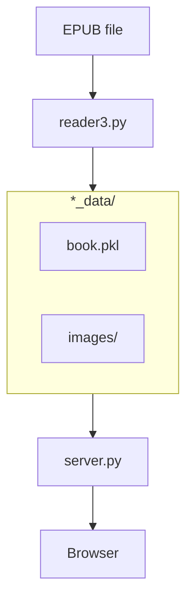

# Architecture

This document describes the high-level architecture of reader3.

## Overview

reader3 is a self-hosted EPUB reader designed for reading books alongside LLMs. The core use case: open an EPUB, read chapter-by-chapter in a browser, copy-paste text to an LLM for discussion.

The system has two phases:
1. **Preprocessing**: Parse an EPUB file into a simplified format on disk
2. **Serving**: Run a web server to browse and read processed books

## Codemap

### reader3.py — EPUB Processor

CLI tool that converts an EPUB into a processed format. Run as `uv run reader3.py book.epub`.

Key types (search for these):
- `Book` — The master data structure, pickled to disk
- `ChapterContent` — A single spine item (physical HTML file from the EPUB)
- `TOCEntry` — Navigation tree node
- `BookMetadata` — Title, authors, etc.

Key functions:
- `process_epub` — Main conversion pipeline
- `parse_toc_recursive` — Builds navigation tree from ebooklib's TOC
- `clean_html_content` — Strips scripts, styles, forms, etc.

Output: Creates `{bookname}_data/` directory containing:
- `book.pkl` — Pickled `Book` object
- `images/` — Extracted images with sanitized filenames

### server.py — Web Server

FastAPI application serving the reader UI. Run as `uv run server.py`.

Routes:
- `/` — Library view (lists all `*_data` folders)
- `/read/{book_id}/{chapter_index}` — Reader view
- `/read/{book_id}/images/{name}` — Image serving

Key function:
- `load_book_cached` — LRU-cached book loading from pickle

### templates/ — Jinja2 Templates

- `library.html` — Book grid with cards
- `reader.html` — Two-column layout: sidebar TOC + main content

## Architectural Invariants

**The processor and server are decoupled.** The server only reads from `*_data/` directories. It never touches EPUB files. You can process books once and serve them forever.

**No database.** The filesystem is the database. Each book is a folder. Delete the folder to remove the book.

**Books are loaded into memory.** The entire `Book` object (including all chapter HTML) is unpickled and cached. This is fine for typical ebooks but won't scale to massive libraries.

**Images are path-rewritten.** The processor rewrites `` paths in the HTML to point to the local `images/` folder. The server then serves these at `/read/{book_id}/images/`.

## Boundaries

**EPUB parsing ↔ Application:** The `ebooklib` library is the only thing that understands EPUB internals. By the time data reaches `Book`, it's clean HTML and metadata.

**Server ↔ Pickle format:** The server depends on the exact structure of `Book` and related dataclasses. Changes to these classes require re-processing existing books.

## Cross-Cutting Concerns

**Dependencies:** beautifulsoup4 for HTML parsing, ebooklib for EPUB, FastAPI + uvicorn for serving, Jinja2 for templates. All specified in pyproject.toml.

**No persistence of reading position.** There's no concept of "current page" or bookmarks. The URL is the state.

**Security:** Image serving uses `os.path.basename()` to prevent path traversal. Pickle loading trusts the local filesystem (don't load untrusted pickles).
